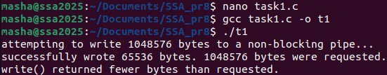
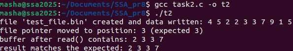
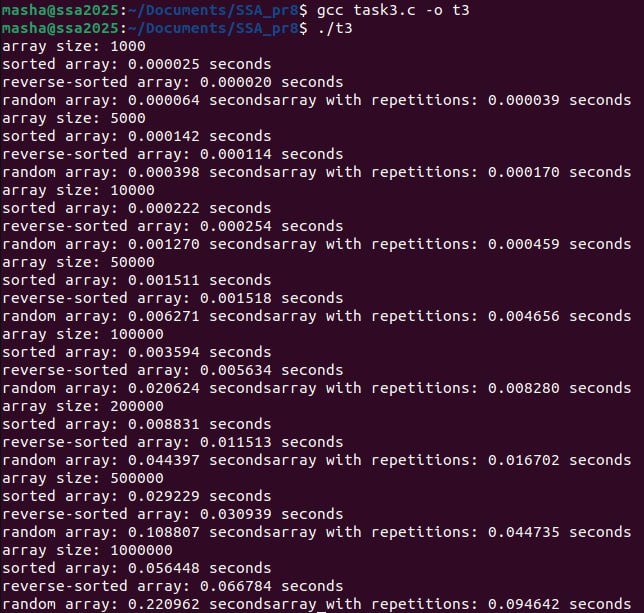
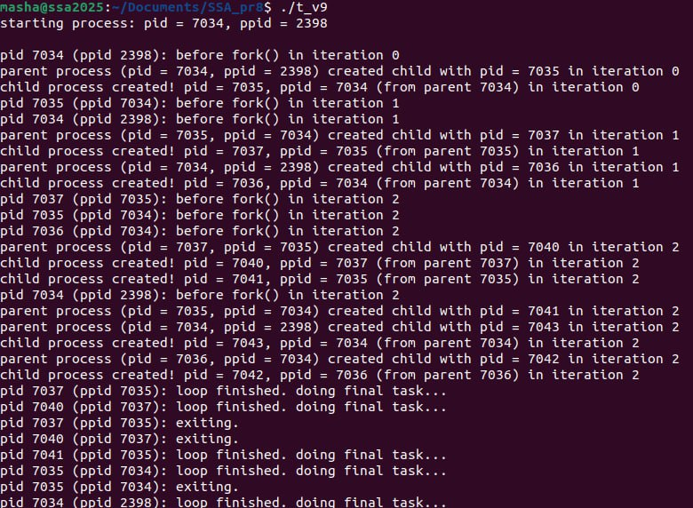

## Задача 1

### Текст завдання

 Чи може виклик count = write(fd, buffer, nbytes); повернути в змінній count значення, відмінне від nbytes? Якщо так, то чому? Наведіть робочий приклад програми, яка демонструє вашу відповідь.
 
### *Реазілація*

досліджуючи поведінку системного виклику write(), ми демонструємо, що write() не завжди записує всі запитувані байти й може повернути менше значення, ніж було вказано. Таке трапляється, наприклад, при використанні неблокуючого вводу/виводу або коли буфер файлового дескриптора (як у випадку з каналом) заповнений, і система не може одразу прийняти всі дані. Наведений приклад ілюструє цю ситуацію, намагаючись записати великий обсяг даних у неблокуючий канал.
_______

## Задача 2
### Текст завдання

Є файл, дескриптор якого — fd. Файл містить таку послідовність байтів: 4, 5, 2, 2, 3, 3, 7, 9, 1, 5. У програмі виконується наступна послідовність системних викликів:
lseek(fd, 3, SEEK_SET);
read(fd, &buffer, 4);
де виклик lseek переміщує покажчик на третій байт файлу. Що буде містити буфер після завершення виклику read? Наведіть робочий приклад програми, яка демонструє вашу відповідь.

 
### *Реазілація*

У цьому завданні ми аналізуємо послідовність системних викликів lseek() та read() для роботи з файлом. Спочатку створюємо файл із заданою послідовністю байтів. Потім lseek() переміщує файловий покажчик на вказану позицію від початку файлу. Після цього read() зчитує байти, починаючи з нової позиції покажчика, і ми перевіряємо, які саме байти були прочитані до буфера.
_______

## Задача 3

### Текст завдання

 Бібліотечна функція qsort призначена для сортування даних будь-якого типу. Для її роботи необхідно підготувати функцію порівняння, яка викликається з qsort кожного разу, коли потрібно порівняти два значення.
 Оскільки значення можуть мати будь-який тип, у функцію порівняння передаються два вказівники типу void* на елементи, що порівнюються.
Напишіть програму, яка досліджує, які вхідні дані є найгіршими для алгоритму швидкого сортування. Спробуйте знайти кілька масивів даних, які змушують qsort працювати якнайповільніше. Автоматизуйте процес експериментування так, щоб підбір і аналіз вхідних даних виконувалися самостійно.

Придумайте і реалізуйте набір тестів для перевірки правильності функції qsort.

 
### *Реазілація*

Це завдання присвячене вивченню продуктивності бібліотечної функції qsort() (швидкого сортування) в різних умовах. Ми генеруємо масиви з відсортованими, обернено відсортованими, випадковими та повторюваними даними, щоб визначити найгірші випадки для алгоритму. Крім вимірювання часу сортування, програма включає набір тестів, які автоматично перевіряють коректність роботи qsort(): чи масив дійсно відсортований і чи не були втрачені або змінені початкові елементи.
_______

## Задача Варіант 9
### Текст завдання

Проведіть тестування: що буде, якщо виконати fork() усередині циклу for із затримкою між викликами?

### *Реазілація*

Ця програма створює нові процеси за допомогою виклику fork() у циклі тричі, і кожен процес (як батьківський, так і дочірній) продовжує виконання циклу. У результаті виникає експоненційне розгалуження процесів, де кожен процес створює ще один на кожній ітерації циклу. Всі процеси виводять інформацію про свій PID, PPID та завершують роботу після виконання свого «остання задача».
_______
